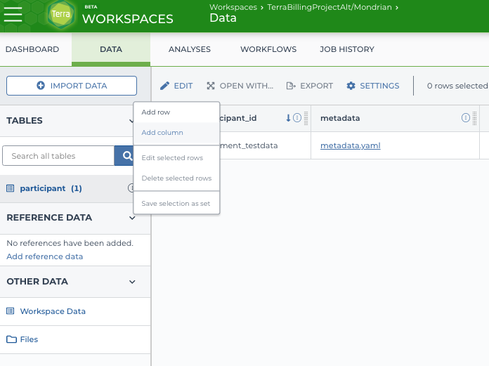
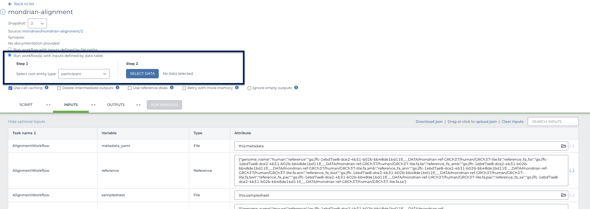

#### Upload Test Data to google storage

Track down the test data from the quickstart guide [here](quickstart/alignment.md).
Please download, extract and upload the alignment test data Google storage


For instance:
```
wget https://mondriantestdata.s3.amazonaws.com/alignment_testdata.tar.gz
tar -xvf alignment_testdata.tar.gz
gsutil cp -r alignment_testdata gs://<bucket-id>/testdata/alignment_testdata 
```


Create a sample sheet with Google storage links to the fastq files.
 ```
    [
            {"cell_id": "SA1090-A96213A-R22-C43",
             "lanes": [
                    {"fastq1": "gs://<bucket-id>/testdata/alignment_testdata/SA1090-A96213A-R22-C43_1.fastq.gz",
                     "fastq2": "gs://<bucket-id>/testdata/alignment_testdata/SA1090-A96213A-R22-C43_2.fastq.gz",
                     "lane_id": "L001",
                     "flowcell_id": "FL001"}
                     ]
            },
            {"cell_id": "SA1090-A96213A-R20-C28",
             "lanes": [
                    {"fastq1": "gs://<bucket-id>/testdata/alignment_testdata/SA1090-A96213A-R20-C28_1.fastq.gz",
                     "fastq2": "gs://<bucket-id>/testdata/alignment_testdata/SA1090-A96213A-R20-C28_2.fastq.gz",
                     "lane_id": "L001",
                     "flowcell_id": "FL001"}
                     ]
            }
    ]
```

upload this samplesheet to the same directory as the data 
```
gsutil cp samplesheet.json gs://<bucket-id>/testdata/alignment_testdata/samplesheet.json
```

#### Setup sample in Terra Data

Go to the Data section of Terra


and click on `Import Data` and then `upload tsv`. Go to `text import Tab`


and enter the participant id
```
entity:participant_id
alignment_testdata
```
and click on import

Once its imported, We'll add 2 columns to the table


For first column: put `metadata` as column name and `gs://<bucket-id>/testdata/alignment_testdata/metadata.yaml` as 
value. For second column: put `samplesheet` as column name 
and `gs://<bucket-id>/testdata/alignment_testdata/samplesheet.json` as value.

The result should look similar to the following


### Setup workflow in Terra Workflows

Go to workflows -> Find a workflow


Add the `alignment.wdl` file to the Broad Methods repository and click on export

choose 'Blank Configuration'
Choose 'participant' as root entity type and choose your billing project


In the workflow configuration page


choose 
`Run workflow(s) with inputs defined by data table`

select `participant` as the root entity type, click on cell data and select the `alignment_testdata` sample


Finish filling in the input entries as follows:

| Field | Value |
|-------|-------|
| metadata_yaml | this.metadata |
| reference | {"genome_name":"human","reference":"gs://<bucket-id>/references/mondrian-ref-GRCh37/human/GRCh37-lite.fa","reference_fa_fai":"gs://<bucket-id>/references/mondrian-ref-GRCh37/human/GRCh37-lite.fa.fai","reference_fa_amb":"gs://<bucket-id>/references/mondrian-ref-GRCh37/human/GRCh37-lite.fa.amb","reference_fa_ann":"gs://<bucket-id>/references/mondrian-ref-GRCh37/human/GRCh37-lite.fa.ann","reference_fa_bwt":"gs://<bucket-id>/references/mondrian-ref-GRCh37/human/GRCh37-lite.fa.bwt","reference_fa_pac":"gs://<bucket-id>/references/mondrian-ref-GRCh37/human/GRCh37-lite.fa.pac","reference_fa_sa":"gs://<bucket-id>/references/mondrian-ref-GRCh37/human/GRCh37-lite.fa.sa"}|
| samplesheet | this.samplesheet |
| supplementary_references| [{"genome_name":"mouse","reference":"gs://<bucket-id>/references/mondrian-ref-GRCh37/mouse/mm10_build38_mouse.fasta","reference_fa_fai":"gs://<bucket-id>/references/mondrian-ref-GRCh37/mouse/mm10_build38_mouse.fasta.fai","reference_fa_amb":"gs://<bucket-id>/references/mondrian-ref-GRCh37/mouse/mm10_build38_mouse.fasta.amb","reference_fa_ann":"gs://<bucket-id>/references/mondrian-ref-GRCh37/mouse/mm10_build38_mouse.fasta.ann","reference_fa_bwt":"gs://<bucket-id>/references/mondrian-ref-GRCh37/mouse/mm10_build38_mouse.fasta.bwt","reference_fa_pac":"gs://<bucket-id>/references/mondrian-ref-GRCh37/mouse/mm10_build38_mouse.fasta.pac","reference_fa_sa":"gs://<bucket-id>/references/mondrian-ref-GRCh37/mouse/mm10_build38_mouse.fasta.sa"},{"genome_name":"salmon","reference":"gs://<bucket-id>/references/mondrian-ref-GRCh37/salmon/GCF_002021735.1_Okis_V1_genomic.fna","reference_fa_fai":"gs://<bucket-id>/references/mondrian-ref-GRCh37/salmon/GCF_002021735.1_Okis_V1_genomic.fna.fai","reference_fa_amb":"gs://<bucket-id>/references/mondrian-ref-GRCh37/salmon/GCF_002021735.1_Okis_V1_genomic.fna.amb","reference_fa_ann":"gs://<bucket-id>/references/mondrian-ref-GRCh37/salmon/GCF_002021735.1_Okis_V1_genomic.fna.ann","reference_fa_bwt":"gs://<bucket-id>/references/mondrian-ref-GRCh37/salmon/GCF_002021735.1_Okis_V1_genomic.fna.bwt","reference_fa_pac":"gs://<bucket-id>/references/mondrian-ref-GRCh37/salmon/GCF_002021735.1_Okis_V1_genomic.fna.pac","reference_fa_sa":"gs://<bucket-id>/references/mondrian-ref-GRCh37/salmon/GCF_002021735.1_Okis_V1_genomic.fna.sa"}] |
| docker_image | "quay.io/mondrianscwgs/alignment:v0.0.71" |


Fill out the output entries as follows:


| Field | Value |
|-------|-------|
| bai | this.bai |
| bam | this.bam |
| tdf | this.tdf |
| contaminaed_bai | this.contaminaed_bai |
| contaminaed_bam | this.contaminaed_bam |
| contaminaed_tdf | this.contaminaed_tdf |
| control_bai | this.control_bai |
| control_bam | this.control_bam |
| control_tdf | this.control_tdf |
| fastqscreen_detailed | this.fastqscreen_detailed |
| fastqscreen_detailed_yaml | this.fastqscreen_detailed_yaml |
| metrics | this.alignment_metrics |
| metrics_yaml | this.alignment_metrics_yaml |
| gc_metrics | this.gc_metrics |
| gc_metrics_yaml | this.gc_metrics_yaml |
| metadata | this.metadata |
| tarfile | this.alignment_metrics_tar |

Save and then run analysis. 